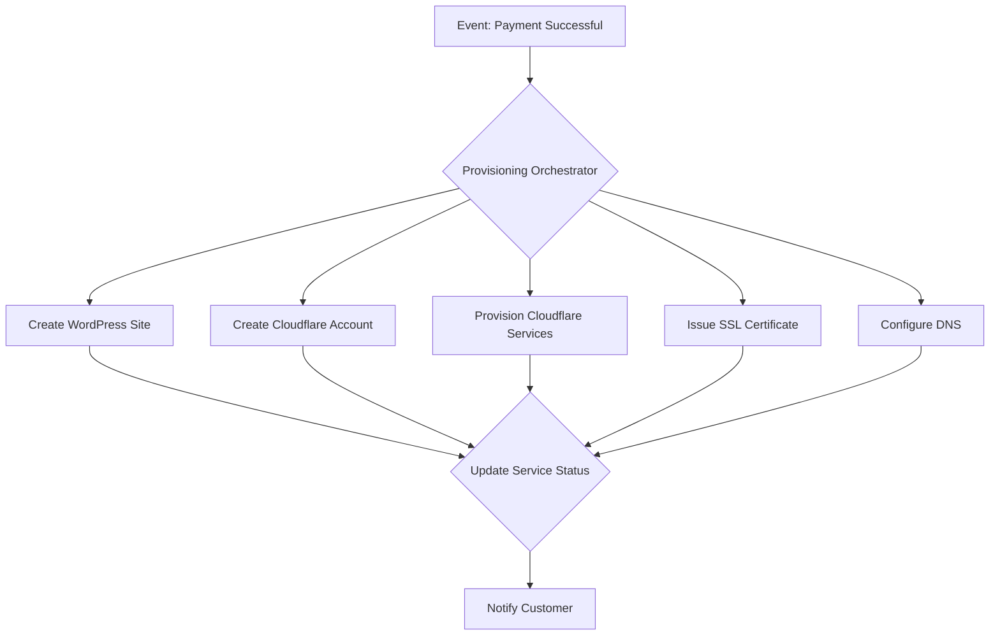

# Service Provisioning Automation: Arumaldo Cloud

## 1. Introduction

This document provides a detailed guide to the automated service provisioning system for the Arumaldo Cloud platform. The goal is to create a fully self-service experience where customers can purchase and activate services without any manual intervention. This automation is the backbone of the platform's scalability and efficiency.

## 2. Provisioning Engine Architecture

The provisioning engine is a collection of Supabase Edge Functions that are triggered by events in the customer lifecycle, primarily after a successful payment.

## 3. Service-Specific Provisioning Flows

### 3.1. WordPress Site Provisioning

1.  **Trigger:** A new subscription is created in Zoho Billing.
2.  **Action:** A Supabase Edge Function is triggered, which calls the Pressable API to create a new WordPress site.
3.  **Parameters:** The site name, datacenter location, and other configuration details are passed to the Pressable API.
4.  **Result:** The Pressable API returns the new site's ID and connection details, which are stored in the Arumaldo Cloud database.

### 3.2. Cloudflare Provisioning

1.  **Trigger:** A new customer account is created.
2.  **Action:**
    - An Edge Function calls the Cloudflare Tenant API to create a new child account for the customer under the Arumaldo Cloud agency account.
    - The selected Cloudflare plan (e.g., Pro, Business) and any add-on services (e.g., Argo, Load Balancing) are provisioned for the customer's account via the Tenant API.
3.  **Result:** The customer has a fully configured Cloudflare account, managed through the Arumaldo Cloud dashboard.

### 3.3. SSL Certificate Provisioning

1.  **Trigger:** A customer purchases a premium SSL certificate.
2.  **Action:**
    - An Edge Function calls the API of the selected SSL reseller (e.g., Sectigo, GoGetSSL).
    - The domain validation process is initiated automatically (e.g., via DNS-based validation).
    - Once validated, the certificate is issued and automatically installed on the customer's website.
3.  **Result:** The customer's website is secured with a premium SSL certificate, and the certificate details are displayed in their dashboard.

### 3.4. DNS Configuration

1.  **Trigger:** A new website is provisioned.
2.  **Action:** An Edge Function calls the Cloudflare API to create the necessary DNS records in the customer's Cloudflare account, pointing their domain to the Pressable site and configuring any other required records (e.g., for email).
3.  **Result:** The customer's domain is correctly configured and pointing to their new website.

## 4. Self-Service Upsell Provisioning

Customers can purchase additional services at any time through their dashboard. The provisioning process for upsells is fully automated:

1.  **Action:** The customer selects an upsell service (e.g., Advanced WAF rules, Premium CDN) and completes the payment.
2.  **Automation:**
    - A new subscription is created in Zoho Billing for the add-on service.
    - The corresponding provisioning Edge Function is triggered (e.g., to enable Advanced WAF rules via the Cloudflare API).
    - The customer's dashboard is updated to reflect the new service.

## 5. Technical Implementation Details

- **Idempotency:** All provisioning API calls must be idempotent to prevent duplicate resources from being created. This can be achieved by passing a unique transaction ID with each request.
- **State Management:** The state of each provisioning job will be tracked in the database (e.g., `pending`, `in_progress`, `completed`, `failed`). This allows for retries and provides visibility into the provisioning process.
- **Error Handling and Rollback:** If any step in the provisioning process fails, the system will attempt to roll back any changes that have already been made. The support team will be notified automatically of any failures.
- **Asynchronous Operations:** Provisioning tasks will be handled asynchronously to avoid blocking the user interface. The customer will see the status of their provisioning jobs in their dashboard.
